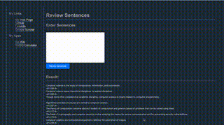

# Go Wiki
- Go Wiki is a wikipedia-like tool where people can create, edit, and delete pages.
- This application contains two more web pages
    - Review Sentences
    - RMSD Calculator

## Install
```bash
poetry install
```
## Command
```bash
cd src
poetry run flask run
go run wiki.go
```

## URL
- http://192.168.10.101:8080/view/
- Flask endpoint: http://127.0.0.1:5000

## Demo
### Review Sentences


### RMSD Calculator
